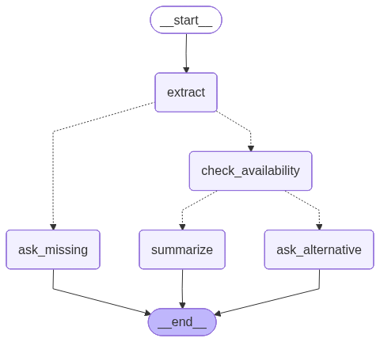

## Purpose

Purpose is just to show basic example of langgraph, nothing fancy, no proper memory management or anything.

This is a meeting scheduler by looking up calendar for available slots. This does not connect to any real calendar, but uses a mock for testing.

It has just 2 use-cases:
1. You can request to book time for an attendee and it will be immediately honored as long as the attendee name does not contain jeff or mike.
2. You can request to book time for any attendee whose name contains jeff or mike and you get a response saying that the seleted date/time not available (no matter what the values are) with 3 suggested time slots. You reply with picking one of them and meeting will be booked.


## Setup

Modify .venv and add your OPENAI_API_KEY.


## Testing

Run agent service in development mode:

```
$ fastapi dev
```

Above service could be invoked from curl client.


### With calendar slot available

Sample request:

```
$ curl -s http://localhost:8000/chat \
  -H 'content-type: application/json' \
  -d '{"session_id":"demo1","message":"Set up a 30 minute meeting with Alex Chen about Q1 planning 01/27/2026 6 pm"}'
```


Note: Use a new session_id every time as the requests are stored in a map in code. It is needed for multi-turn example (shown in the section below).


Response asking for missing info:

```
{"session_id":"demo1","reply":"Who will be hosting the meeting?","state":{"draft":{"host_full_name":null,"attendee_full_name":"Alex Chen","subject":"Q1 planning","start_time_iso":"2026-01-27T18:00:00-08:00","duration_minutes":30,"timezone":"America/Los_Angeles"},"status":"ask_human","suggestions":[],"override":false,"messages":["Who will be hosting the meeting?"]}}
```


Then send host details:

```
$ curl -s http://localhost:8000/chat \
  -H 'content-type: application/json' \
  -d '{"session_id":"demo1","message":"meeting hosted by saibaba"}'                                                  
```


Final response:

```
{"session_id":"demo1","reply":"The Q1 planning meeting with Alex Chen has been successfully scheduled for January 27, 2026, at 6:00 PM PST. The meeting is set to last for 30 minutes and was organized by the host, Saibaba.","state":{"draft":{"host_full_name":"saibaba","attendee_full_name":"Alex Chen","subject":"Q1 planning","start_time_iso":"2026-01-27T18:00:00-08:00","duration_minutes":30,"timezone":"America/Los_Angeles"},"status":"booked","suggestions":[],"booked_event":{"id":"1","host_full_name":"saibaba","attendee_full_name":"Alex Chen","subject":"Q1 planning","start_time_iso":"2026-01-27T18:00:00-08:00","duration_minutes":30},"override":false,"messages":["The Q1 planning meeting with Alex Chen has been successfully scheduled for January 27, 2026, at 6:00 PM PST. The meeting is set to last for 30 minutes and was organized by the host, Saibaba."]}}
```


### With calendar slot busy, a two-turn example


If the meeting is with any person whose name contains jeff or mike, the first time request is made, calender shows busy and agent suggests alternate slots.

Sample request:

```
$ curl -s http://localhost:8000/chat \
  -H 'content-type: application/json' \
  -d '{"session_id":"demo2","message":"Set up a 30 minute meeting with jeff  Chen about Q1 planning 01/27/2026 6 pm"}'
```

Response asking for missing info:

```
{"session_id":"demo2","reply":"Who will be hosting the meeting?","state":{"draft":{"host_full_name":null,"attendee_full_name":"Jeff Chen","subject":"Q1 planning","start_time_iso":"2026-01-27T18:00:00-08:00","duration_minutes":30,"timezone":"America/Los_Angeles"},"status":"ask_human","suggestions":[],"override":false,"messages":["Who will be hosting the meeting?"]}}
```

Send host info:

```
curl -s http://localhost:8000/chat \
  -H 'content-type: application/json' \
  -d '{"session_id":"demo2","message":"meeting hosted by saibaba"}'                                                  
```


Response asking to pick a slot:
```
{"session_id":"demo2","reply":"Please choose a new time for the \"Q1 planning\" meeting with Jeff Chen from the options below:\n\n1. Wednesday, January 28 at 9:00 AM (PST)\n2. Wednesday, January 28 at 9:30 AM (PST)\n3. Wednesday, January 28 at 10:00 AM (PST)\n\nWhich option works best for you, or would you like to propose another time?","state":{"draft":{"host_full_name":"saibaba","attendee_full_name":"Jeff Chen","subject":"Q1 planning","start_time_iso":"2026-01-27T18:00:00-08:00","duration_minutes":30,"timezone":"America/Los_Angeles"},"status":"ask_human","suggestions":[{"start_time_iso":"2026-01-28T09:00:00-08:00","duration_minutes":30},{"start_time_iso":"2026-01-28T09:30:00-08:00","duration_minutes":30},{"start_time_iso":"2026-01-28T10:00:00-08:00","duration_minutes":30}],"override":true,"messages":["Please choose a new time for the \"Q1 planning\" meeting with Jeff Chen from the options below:\n\n1. Wednesday, January 28 at 9:00 AM (PST)\n2. Wednesday, January 28 at 9:30 AM (PST)\n3. Wednesday, January 28 at 10:00 AM (PST)\n\nWhich option works best for you, or would you like to propose another time?"]}}
```


Send a new message with one of the slots picked:

Request:

```
$ curl -s http://localhost:8000/chat \
  -H 'content-type: application/json' \
  -d '{"session_id":"demo2","message":"Wednesday, January 28 at 9:00 AM (PST) works the best!"}'
```

Response with booking confirmed:

```
{"session_id":"demo2","reply":"The meeting titled \"Q1 Planning with Jeff Chen\" has been successfully scheduled. It will take place on January 28, 2027, at 9:00 AM PST and is set to last for 30 minutes. The meeting was organized by the host, Saibaba.","state":{"draft":{"host_full_name":"saibaba","attendee_full_name":"Jeff Chen","subject":"Q1 planning","start_time_iso":"2027-01-28T09:00:00-08:00","duration_minutes":30,"timezone":"PST"},"status":"booked","suggestions":[{"start_time_iso":"2026-01-28T09:00:00-08:00","duration_minutes":30},{"start_time_iso":"2026-01-28T09:30:00-08:00","duration_minutes":30},{"start_time_iso":"2026-01-28T10:00:00-08:00","duration_minutes":30}],"booked_event":{"id":"1","host_full_name":"saibaba","attendee_full_name":"Jeff Chen","subject":"Q1 planning","start_time_iso":"2027-01-28T09:00:00-08:00","duration_minutes":30},"override":true,"messages":["The meeting titled \"Q1 Planning with Jeff Chen\" has been successfully scheduled. It will take place on January 28, 2027, at 9:00 AM PST and is set to last for 30 minutes. The meeting was organized by the host, Saibaba."]}}
```

## Langchain workflow




## Building

```
$ python3 -m venv .venv
$ source .venv/bin/activate
$ pip install -e .
$ pip install build
$ python3 -m build
```

Now you can start python interpreter and import modules.

## workflow image

Running the following command generates the image:

```
$ python3 gen_graph.py
```

## TODO

1. Replace mock calander with real one

